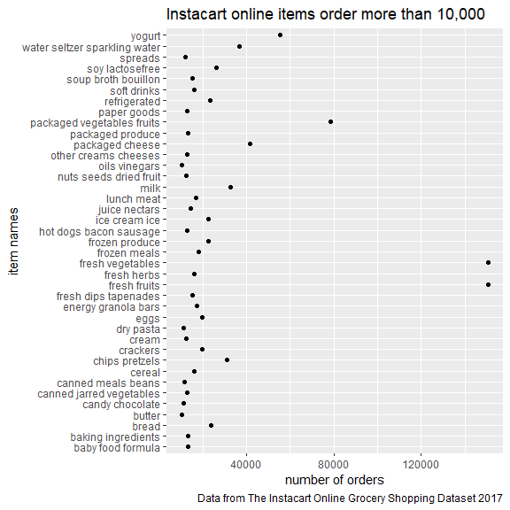

P8105 homework 3
================
Yu He
10/14/2021

Load packages and dataset

``` r
library(tidyverse)
```

    ## -- Attaching packages --------------------------------------- tidyverse 1.3.1 --

    ## v ggplot2 3.3.5     v purrr   0.3.4
    ## v tibble  3.1.4     v dplyr   1.0.7
    ## v tidyr   1.1.3     v stringr 1.4.0
    ## v readr   2.0.1     v forcats 0.5.1

    ## -- Conflicts ------------------------------------------ tidyverse_conflicts() --
    ## x dplyr::filter() masks stats::filter()
    ## x dplyr::lag()    masks stats::lag()

``` r
library(p8105.datasets)
data("instacart")

knitr::opts_chunk$set(
  fig.width = 6,
  fig.asp = 1,
  out.width = "90%"
)
```

## Problem 1

Description of the dataset,

part 1 a, number of aisels - 134 items

``` r
instacart_df =
  force(instacart) %>% 
  group_by(aisle) %>% 
  summarize(n_obs = n())
```

part 1 b, top 3 items ordered in the aisles - fresh vegetables, fresh
fruits, and packaged vagetables fruits.

``` r
instacart_most_aisle =
  force(instacart) %>% 
  group_by(aisle) %>% 
  summarize(n_obs = n()) %>% 
  mutate(
    top_order_aisles = min_rank(n_obs)
  ) %>% 
  arrange(desc(n_obs)) %>% 
  filter(top_order_aisles > 131)
```

part 2 plot of number of items ordered in each aisles

``` r
instacart_df %>% 
  group_by(aisle) %>% 
  filter(as.numeric(n_obs) > 10000) %>% 
  ggplot(aes(x = n_obs, y = aisle)) +
  geom_point() +
  labs(
    title = "Instacart online items order more than 10,000",
    x = "number of orders",
    y = "item names",
    caption = "Data from The Instacart Online Grocery Shopping Dataset 2017"
  ) 
```



part 3 table of top three product in baking ingredients”, “dog food
care”, and “packaged vegetables fruits” listed in aisles.

``` r
pop_product = 
  instacart %>% 
  filter(aisle %in% c("baking ingredients", "dog food care", "packaged vegetables fruits")) %>% 
  select(product_name, aisle) %>% 
  group_by(product_name, aisle) %>% 
  summarize(n_obs = n())
```

    ## `summarise()` has grouped output by 'product_name'. You can override using the `.groups` argument.

``` r
top3_bi = 
  pop_product %>% 
  filter(aisle == "baking ingredients") %>%
  mutate(
    prod_rank = min_rank(n_obs)
  ) %>% 
  arrange(desc(n_obs)) %>% 
  filter(n_obs > 329) %>% 
  select(-prod_rank)

top3_dfc =
  pop_product %>% 
    filter(aisle == "dog food care") %>%
  mutate(
    prod_rank = min_rank(n_obs)
  ) %>% 
  arrange(desc(n_obs)) %>% 
  filter(n_obs > 25) %>% 
  select(-prod_rank)

top3_pvf =
  pop_product %>% 
    filter(aisle == "packaged vegetables fruits") %>%
  mutate(
    prod_rank = min_rank(n_obs)
  ) %>% 
  arrange(desc(n_obs)) %>% 
  filter(n_obs > 4059) %>% 
  select(-prod_rank)

top3_product = bind_rows(top3_bi, top3_dfc, top3_pvf)
```

part 4 table of Pink Lady Apples and Coffee Ice Cream

``` r
apple_cream_df =
  force(instacart) %>% 
  select(order_dow, order_hour_of_day, product_name) %>% 
  filter(product_name %in% c("Pink Lady Apples", "Coffee Ice Cream")) %>% 
  group_by(order_dow, order_hour_of_day) %>% 
  summarize(mean_order_hod = mean(order_hour_of_day))
```

    ## `summarise()` has grouped output by 'order_dow'. You can override using the `.groups` argument.

Description of the data set, noting the size and structure of the data
describing some key variables and giving illustrative examples of
observations

The ‘instacart’ dataset is the order history of over 3 million online
orders collected from more than 200,000 instacart users. The dataset
includes
