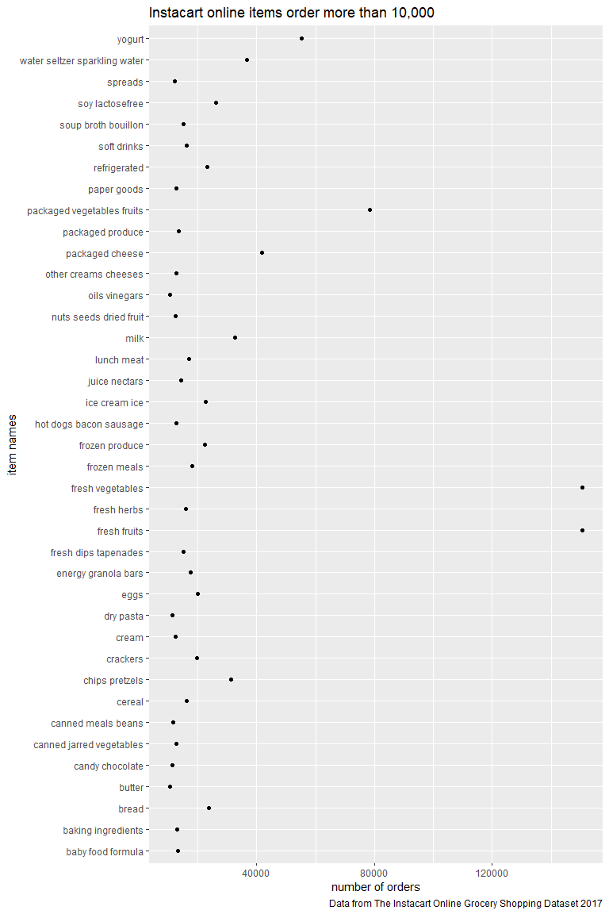
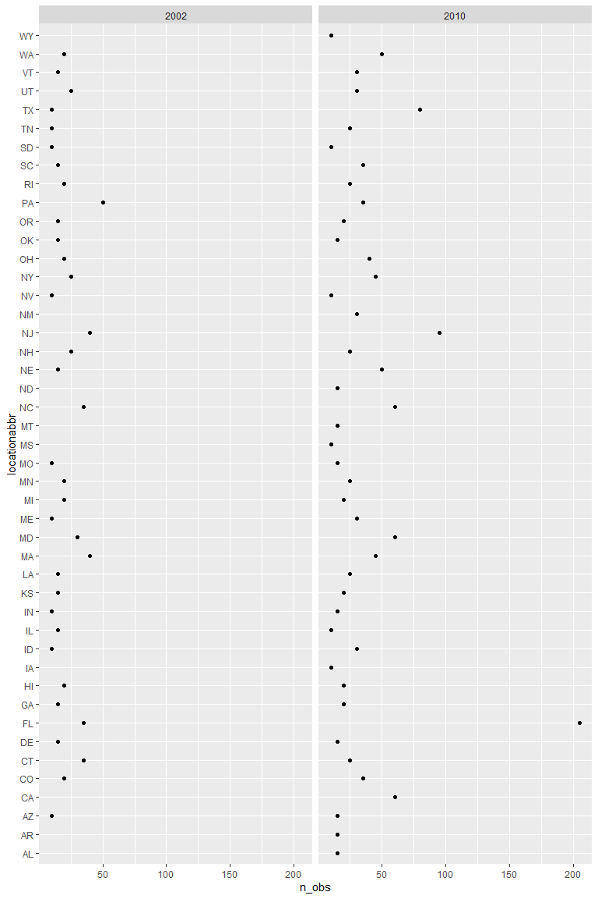
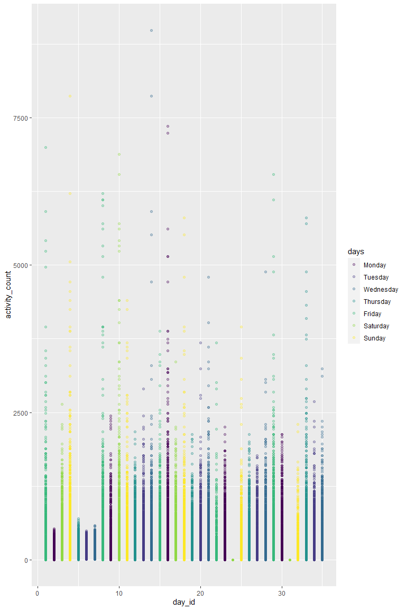

P8105 homework 3
================
Yu He
10/14/2021

Load packages and dataset

``` r
library(tidyverse)
```

    ## -- Attaching packages --------------------------------------- tidyverse 1.3.1 --

    ## v ggplot2 3.3.5     v purrr   0.3.4
    ## v tibble  3.1.4     v dplyr   1.0.7
    ## v tidyr   1.1.3     v stringr 1.4.0
    ## v readr   2.0.1     v forcats 0.5.1

    ## -- Conflicts ------------------------------------------ tidyverse_conflicts() --
    ## x dplyr::filter() masks stats::filter()
    ## x dplyr::lag()    masks stats::lag()

``` r
library(p8105.datasets)


knitr::opts_chunk$set(
  fig.width = 8,
  fig.asp = 1.5,
  out.width = "90%"
)
```

## Problem 1

Description of the dataset, load instacart data

The ‘instacart’ dataset is the order history of over 3 million online
orders collected from more than 200,000 instacart users. The dataset
includes order_id, product_id, add_to_cart_order, reordered, user_id,
eval_set, order_number, order_dow, order_hour_of_day,
days_since_prior_order, product_name, aisle_id, department_id, aisle,
department variables.

The dataset contains 1,384,617 observations of 131,209 unique users.
Each column represent a variable that indicate specific information. THe
produc name variable shows the name of the product that were ordered on
Instacart. the department variable show the name of department where the
products were located. The aisle variable represents the name of the
aisle, which includes 134 types of items. Among all the items listed in
aisle, fresh vegetables, fresh fruits, and packaged vegetables fruits
are the top three items ordered through Instacart. Figure in part 2
shows the online order items, which were order more than 10,000 times.
The fresh vegetables and fresh fruits were order much more often than
all the other items.They are almost the 5 times of the average order
time of all the other items.

``` r
data("instacart")
```

part 1(a), number of aisels - 134 items

``` r
instacart_df =
  force(instacart) %>% 
  group_by(aisle) %>% 
  summarize(n_obs = n())
```

part 1(b), top 3 aisles ordered are fresh vegetables, fresh fruits, and
packaged vegetables fruits.The fresh vegetables and fresh fruits were
ordered more 150,000 times.

``` r
instacart_most_aisle =
  force(instacart) %>% 
  group_by(aisle) %>% 
  summarize(n_obs = n()) %>% 
  mutate(
    top_order_aisles = min_rank(n_obs)
  ) %>% 
  arrange(desc(n_obs)) %>% 
  filter(top_order_aisles > 131)
```

part 2 plot of number of items ordered in each aisles

The fresh vegetables and fresh fruits, which were order more than
150,000 time, were order much more often than all the other items. They
are almost the 5 times of the average order time of all the other items.
The packaged vegetables fruits were ordered about 80,000 times. All the
other products were order about 20,000 time.

``` r
instacart_df %>% 
  group_by(aisle) %>% 
  filter(as.numeric(n_obs) > 10000) %>% 
  ggplot(aes(x = n_obs, y = aisle)) +
  geom_point() +
  labs(
    title = "Instacart online items order more than 10,000",
    x = "number of orders",
    y = "item names",
    caption = "Data from The Instacart Online Grocery Shopping Dataset 2017"
  ) 
```



part 3 table of top three product in baking ingredients”, “dog food
care”, and “packaged vegetables fruits” listed in aisles.

The packaged vegetables fruits were ordered about ten time more often
than other two types of items. Among packaged vegetables fruits, the
organic baby spinach was ordered twice more often the other two types of
items. the products in dog food care aisle were order about 30 times,
which was 10% of the order time of baking ingredients. People are in
great need of packaged vegetable fruits than other two aisles.

``` r
pop_product = 
  instacart %>% 
  filter(aisle %in% c("baking ingredients", "dog food care", "packaged vegetables fruits")) %>% 
  select(product_name, aisle) %>% 
  group_by(product_name, aisle) %>% 
  summarize(n_obs = n())
```

    ## `summarise()` has grouped output by 'product_name'. You can override using the `.groups` argument.

``` r
top3_bi = 
  pop_product %>% 
  filter(aisle == "baking ingredients") %>%
  mutate(
    prod_rank = min_rank(n_obs)
  ) %>% 
  arrange(desc(n_obs)) %>% 
  filter(n_obs > 329) %>% 
  select(-prod_rank)

top3_dfc =
  pop_product %>% 
    filter(aisle == "dog food care") %>%
  mutate(
    prod_rank = min_rank(n_obs)
  ) %>% 
  arrange(desc(n_obs)) %>% 
  filter(n_obs > 25) %>% 
  select(-prod_rank)

top3_pvf =
  pop_product %>% 
    filter(aisle == "packaged vegetables fruits") %>%
  mutate(
    prod_rank = min_rank(n_obs)
  ) %>% 
  arrange(desc(n_obs)) %>% 
  filter(n_obs > 4059) %>% 
  select(-prod_rank)

top3_product = bind_rows(top3_bi, top3_dfc, top3_pvf) %>% 
  knitr::kable()

top3_product
```

| product_name                                  | aisle                      | n_obs |
|:----------------------------------------------|:---------------------------|------:|
| Light Brown Sugar                             | baking ingredients         |   499 |
| Pure Baking Soda                              | baking ingredients         |   387 |
| Cane Sugar                                    | baking ingredients         |   336 |
| Snack Sticks Chicken & Rice Recipe Dog Treats | dog food care              |    30 |
| Organix Chicken & Brown Rice Recipe           | dog food care              |    28 |
| Small Dog Biscuits                            | dog food care              |    26 |
| Organic Baby Spinach                          | packaged vegetables fruits |  9784 |
| Organic Raspberries                           | packaged vegetables fruits |  5546 |
| Organic Blueberries                           | packaged vegetables fruits |  4966 |

part 4 table of Pink Lady Apples and Coffee Ice Cream

The average order time of coffee ice cream is higher on Tuesday,
Thursday, and Wednesday. And the average order time of pink lady apples
is higher on Wednesday, Friday, and Sunday. The order times are closed
between coffee ice cream and pink lady apples on Friday and Sunday.

``` r
apple_cream_df =
  force(instacart) %>% 
  select(order_dow, order_hour_of_day, product_name) %>% 
  filter(product_name %in% c("Pink Lady Apples", "Coffee Ice Cream")) %>% 
  mutate(order_dow = recode(order_dow, "0" = "Sunday", "1" = "Monday", "2" = "Tuesday", "3" = "Wednesday", "4" = "Thursday", "5" = "Friday", "6" = "Saturday")) %>% 
  group_by(order_dow, product_name) %>% 
  summarize(mean_order_hour = mean(order_hour_of_day)) %>% 
  pivot_wider(names_from = order_dow, values_from = mean_order_hour) %>% 
  knitr::kable()
```

    ## `summarise()` has grouped output by 'order_dow'. You can override using the `.groups` argument.

``` r
apple_cream_df
```

| product_name     |   Friday |   Monday | Saturday |   Sunday | Thursday |  Tuesday | Wednesday |
|:-----------------|---------:|---------:|---------:|---------:|---------:|---------:|----------:|
| Coffee Ice Cream | 12.26316 | 14.31579 | 13.83333 | 13.77419 | 15.21739 | 15.38095 |  15.31818 |
| Pink Lady Apples | 12.78431 | 11.36000 | 11.93750 | 13.44118 | 11.55172 | 11.70213 |  14.25000 |

## Problem 2

part 1 load, clean and manipulate the BRFSS data

factor(response, levels = c(“Poor”, “Fair”, “Good”, “Very good”,
“Excellent”))

``` r
data("brfss_smart2010") 
```

``` r
health_data_df =
  force(brfss_smart2010) %>% 
  janitor::clean_names() %>% 
  filter(topic == "Overall Health") %>% 
  filter(response %in% c("Poor", "Fair", "Good", "Very good", "Excellent")) %>% 
  group_by(response) %>% 
  mutate(
    response = factor(response, levels = c("Poor", "Fair", "Good", "Very good", "Excellent"))
  )
```

part 2(a) states observation in 2002 and 2010

In 2002, 36 states were observed at 7 or more locations. And in 2010, 45
states were observed 7 or more locations. In addition, the figure
illustrate us that the states were observed more time in 2010 than in
2002. And FL was observed more than 200 location in 2010.

``` r
location_df =
  health_data_df %>% 
  filter(year %in% c("2002", "2010")) %>% 
  group_by(year, locationabbr) %>% 
  summarize(n_obs = n()) %>% 
  filter(n_obs > 6) %>% 
  ggplot(aes(x = n_obs, y = locationabbr)) +
  geom_point() +
  facet_wrap(~ year)
```

    ## `summarise()` has grouped output by 'year'. You can override using the `.groups` argument.

``` r
location_df
```



part 2(b) plot of average value within a state over time

The overall trend of the average data value of Excellent response within
the states is slightly decreased from 2002 to 2010. Some states
includes, FL, IL, LA, WY, CA, CT, experience extreme average data value
of Excellent response change between 2004 and 2008. Some states
includes, ME, MI, MS, MT, NC has relatively stable average data of
Excellent response trends. Among these state, WY has the lowest average
data value of Excellent response.

``` r
state_plot_df =
  health_data_df %>% 
  filter(response == "Excellent") %>% 
  select(year, locationabbr, locationdesc, data_value) %>% 
  group_by(year, locationabbr) %>% 
  summarize(mean_state_value = mean(data_value)) %>% 
  ggplot(aes(x = year, y = mean_state_value, group = locationabbr, color = locationabbr)) +
  geom_line(alpha = .7) +
   viridis::scale_color_viridis(
    name = "States",
    discrete = TRUE
  )
```

    ## Adding missing grouping variables: `response`

    ## `summarise()` has grouped output by 'year'. You can override using the `.groups` argument.

``` r
state_plot_df
```

    ## Warning: Removed 3 row(s) containing missing values (geom_path).


part 2(c) two panel plot from 2006 and 2010 at NY state

The observation of response in NY states includes more Good, Very good,
and Excellent than Poor and Fair. And we have observed little difference
of the overall response between 2006 and 2010. Among counties in NY
state, we observed more Very good and Excellent response in Westchester
county in 2010. And we observed more Poor to Good response in Bronx
county in 2010. However, 2006 has different observations of response. We
oberved more Poor and Fair response in Queens county, and more Good to
Excellent response in Nassau county.

``` r
NY_data_df =
  health_data_df %>% 
  filter(locationabbr == "NY") %>% 
  filter(year %in% c("2006", "2010")) %>% 
  select(year, locationabbr,locationdesc, response, data_value) %>% 
  ggplot(aes(x = response, y = data_value, group = locationdesc, color = locationdesc)) +
  geom_point(alpha = .7) +
  facet_wrap(~ year) +
  labs(
    title = "BRFSS NY state data plot 2006 and 2010",
    caption = "Data from SMART project"
  ) +
  viridis::scale_color_viridis(
    name = "Counties",
    discrete = TRUE
  )
NY_data_df
```


## Problem 3

part 1 load and manipulate data

After manipulation the data, we have variables include week, day id,
day, weekday_end, and activity.\*. The dataset recorded the activity
counts of five week (35 days), 25 weekdays, 10 weekend days, and 1,440
minutes of each day.

``` r
accel_data =
  read_csv("accel_data.csv") %>% 
  janitor::clean_names() %>% 
  mutate(
    weekday_end = recode(day, "Monday" = "Weekday", "Tuesday" = "Weekday", "Wednesday" = "Weekday", "Thursday" = "Weekday", "Friday" = "Weekday", "Saturday" = "Weekend", "Sunday" = "Weekend")
  ) %>% 
  select(week, day_id, day, weekday_end, everything()) %>% 
  mutate(
    day = ordered(day, levels = c("Monday", "Tuesday", "Wednesday", "Thursday", "Friday", "Saturday", "Sunday"))
  )
```

    ## Rows: 35 Columns: 1443

    ## -- Column specification --------------------------------------------------------
    ## Delimiter: ","
    ## chr    (1): day
    ## dbl (1442): week, day_id, activity.1, activity.2, activity.3, activity.4, ac...

    ## 
    ## i Use `spec()` to retrieve the full column specification for this data.
    ## i Specify the column types or set `show_col_types = FALSE` to quiet this message.

part 2 total activity over the day

The figure of day_id over activity_day did not show any special overall
trend of daily activity. However, activity distributed closely around
4e+05 from day 10 to day 20. The activities in Monday increased from day
1 to day 17, and decreased to 4e+05 at day 23. The activity in Tuesday
and Wednesday are relatively stable around 4e+05. The activities in
Thursday remained stable around 4e+05 before day 26 and increased to
5.5e+05 until the end. The activities in Friday dropped from 5e+05 at
day 1 to 1.5e+05 at day 22 and increased back to 5.5e+05 at the last
day. The activities in Saturday and Sunday dropped significantly from
day 1 to day 35.

``` r
accel_day =
  accel_data %>% 
  mutate(
    activity_day = rowSums(select(., starts_with("activity")))
  ) %>% 
  select(week, day_id, day, weekday_end, activity_day) %>% 
  ggplot(aes(x = day_id, y = activity_day, color = day)) +
  geom_point() +
    viridis::scale_color_viridis(
    name = "Counties",
    discrete = TRUE
  ) +
  geom_smooth()
accel_day
```

    ## `geom_smooth()` using method = 'loess' and formula 'y ~ x'

    ## Warning in simpleLoess(y, x, w, span, degree = degree, parametric =
    ## parametric, : span too small. fewer data values than degrees of freedom.

    ## Warning in simpleLoess(y, x, w, span, degree = degree, parametric =
    ## parametric, : pseudoinverse used at 1.86

    ## Warning in simpleLoess(y, x, w, span, degree = degree, parametric =
    ## parametric, : neighborhood radius 14.14

    ## Warning in simpleLoess(y, x, w, span, degree = degree, parametric =
    ## parametric, : reciprocal condition number 0

    ## Warning in simpleLoess(y, x, w, span, degree = degree, parametric =
    ## parametric, : There are other near singularities as well. 199.94

    ## Warning in predLoess(object$y, object$x, newx = if
    ## (is.null(newdata)) object$x else if (is.data.frame(newdata))
    ## as.matrix(model.frame(delete.response(terms(object)), : span too small. fewer
    ## data values than degrees of freedom.

    ## Warning in predLoess(object$y, object$x, newx = if
    ## (is.null(newdata)) object$x else if (is.data.frame(newdata))
    ## as.matrix(model.frame(delete.response(terms(object)), : pseudoinverse used at
    ## 1.86

    ## Warning in predLoess(object$y, object$x, newx = if
    ## (is.null(newdata)) object$x else if (is.data.frame(newdata))
    ## as.matrix(model.frame(delete.response(terms(object)), : neighborhood radius
    ## 14.14

    ## Warning in predLoess(object$y, object$x, newx = if
    ## (is.null(newdata)) object$x else if (is.data.frame(newdata))
    ## as.matrix(model.frame(delete.response(terms(object)), : reciprocal condition
    ## number 0

    ## Warning in predLoess(object$y, object$x, newx = if
    ## (is.null(newdata)) object$x else if (is.data.frame(newdata))
    ## as.matrix(model.frame(delete.response(terms(object)), : There are other near
    ## singularities as well. 199.94

    ## Warning in simpleLoess(y, x, w, span, degree = degree, parametric =
    ## parametric, : span too small. fewer data values than degrees of freedom.

    ## Warning in simpleLoess(y, x, w, span, degree = degree, parametric =
    ## parametric, : pseudoinverse used at 5.86

    ## Warning in simpleLoess(y, x, w, span, degree = degree, parametric =
    ## parametric, : neighborhood radius 14.14

    ## Warning in simpleLoess(y, x, w, span, degree = degree, parametric =
    ## parametric, : reciprocal condition number 0

    ## Warning in simpleLoess(y, x, w, span, degree = degree, parametric =
    ## parametric, : There are other near singularities as well. 199.94

    ## Warning in predLoess(object$y, object$x, newx = if
    ## (is.null(newdata)) object$x else if (is.data.frame(newdata))
    ## as.matrix(model.frame(delete.response(terms(object)), : span too small. fewer
    ## data values than degrees of freedom.

    ## Warning in predLoess(object$y, object$x, newx = if
    ## (is.null(newdata)) object$x else if (is.data.frame(newdata))
    ## as.matrix(model.frame(delete.response(terms(object)), : pseudoinverse used at
    ## 5.86

    ## Warning in predLoess(object$y, object$x, newx = if
    ## (is.null(newdata)) object$x else if (is.data.frame(newdata))
    ## as.matrix(model.frame(delete.response(terms(object)), : neighborhood radius
    ## 14.14

    ## Warning in predLoess(object$y, object$x, newx = if
    ## (is.null(newdata)) object$x else if (is.data.frame(newdata))
    ## as.matrix(model.frame(delete.response(terms(object)), : reciprocal condition
    ## number 0

    ## Warning in predLoess(object$y, object$x, newx = if
    ## (is.null(newdata)) object$x else if (is.data.frame(newdata))
    ## as.matrix(model.frame(delete.response(terms(object)), : There are other near
    ## singularities as well. 199.94

    ## Warning in simpleLoess(y, x, w, span, degree = degree, parametric =
    ## parametric, : span too small. fewer data values than degrees of freedom.

    ## Warning in simpleLoess(y, x, w, span, degree = degree, parametric =
    ## parametric, : pseudoinverse used at 6.86

    ## Warning in simpleLoess(y, x, w, span, degree = degree, parametric =
    ## parametric, : neighborhood radius 14.14

    ## Warning in simpleLoess(y, x, w, span, degree = degree, parametric =
    ## parametric, : reciprocal condition number 0

    ## Warning in simpleLoess(y, x, w, span, degree = degree, parametric =
    ## parametric, : There are other near singularities as well. 199.94

    ## Warning in predLoess(object$y, object$x, newx = if
    ## (is.null(newdata)) object$x else if (is.data.frame(newdata))
    ## as.matrix(model.frame(delete.response(terms(object)), : span too small. fewer
    ## data values than degrees of freedom.

    ## Warning in predLoess(object$y, object$x, newx = if
    ## (is.null(newdata)) object$x else if (is.data.frame(newdata))
    ## as.matrix(model.frame(delete.response(terms(object)), : pseudoinverse used at
    ## 6.86

    ## Warning in predLoess(object$y, object$x, newx = if
    ## (is.null(newdata)) object$x else if (is.data.frame(newdata))
    ## as.matrix(model.frame(delete.response(terms(object)), : neighborhood radius
    ## 14.14

    ## Warning in predLoess(object$y, object$x, newx = if
    ## (is.null(newdata)) object$x else if (is.data.frame(newdata))
    ## as.matrix(model.frame(delete.response(terms(object)), : reciprocal condition
    ## number 0

    ## Warning in predLoess(object$y, object$x, newx = if
    ## (is.null(newdata)) object$x else if (is.data.frame(newdata))
    ## as.matrix(model.frame(delete.response(terms(object)), : There are other near
    ## singularities as well. 199.94

    ## Warning in simpleLoess(y, x, w, span, degree = degree, parametric =
    ## parametric, : span too small. fewer data values than degrees of freedom.

    ## Warning in simpleLoess(y, x, w, span, degree = degree, parametric =
    ## parametric, : pseudoinverse used at 4.86

    ## Warning in simpleLoess(y, x, w, span, degree = degree, parametric =
    ## parametric, : neighborhood radius 14.14

    ## Warning in simpleLoess(y, x, w, span, degree = degree, parametric =
    ## parametric, : reciprocal condition number 0

    ## Warning in simpleLoess(y, x, w, span, degree = degree, parametric =
    ## parametric, : There are other near singularities as well. 199.94

    ## Warning in predLoess(object$y, object$x, newx = if
    ## (is.null(newdata)) object$x else if (is.data.frame(newdata))
    ## as.matrix(model.frame(delete.response(terms(object)), : span too small. fewer
    ## data values than degrees of freedom.

    ## Warning in predLoess(object$y, object$x, newx = if
    ## (is.null(newdata)) object$x else if (is.data.frame(newdata))
    ## as.matrix(model.frame(delete.response(terms(object)), : pseudoinverse used at
    ## 4.86

    ## Warning in predLoess(object$y, object$x, newx = if
    ## (is.null(newdata)) object$x else if (is.data.frame(newdata))
    ## as.matrix(model.frame(delete.response(terms(object)), : neighborhood radius
    ## 14.14

    ## Warning in predLoess(object$y, object$x, newx = if
    ## (is.null(newdata)) object$x else if (is.data.frame(newdata))
    ## as.matrix(model.frame(delete.response(terms(object)), : reciprocal condition
    ## number 0

    ## Warning in predLoess(object$y, object$x, newx = if
    ## (is.null(newdata)) object$x else if (is.data.frame(newdata))
    ## as.matrix(model.frame(delete.response(terms(object)), : There are other near
    ## singularities as well. 199.94

    ## Warning in simpleLoess(y, x, w, span, degree = degree, parametric =
    ## parametric, : span too small. fewer data values than degrees of freedom.

    ## Warning in simpleLoess(y, x, w, span, degree = degree, parametric =
    ## parametric, : pseudoinverse used at 0.86

    ## Warning in simpleLoess(y, x, w, span, degree = degree, parametric =
    ## parametric, : neighborhood radius 14.14

    ## Warning in simpleLoess(y, x, w, span, degree = degree, parametric =
    ## parametric, : reciprocal condition number 0

    ## Warning in simpleLoess(y, x, w, span, degree = degree, parametric =
    ## parametric, : There are other near singularities as well. 199.94

    ## Warning in predLoess(object$y, object$x, newx = if
    ## (is.null(newdata)) object$x else if (is.data.frame(newdata))
    ## as.matrix(model.frame(delete.response(terms(object)), : span too small. fewer
    ## data values than degrees of freedom.

    ## Warning in predLoess(object$y, object$x, newx = if
    ## (is.null(newdata)) object$x else if (is.data.frame(newdata))
    ## as.matrix(model.frame(delete.response(terms(object)), : pseudoinverse used at
    ## 0.86

    ## Warning in predLoess(object$y, object$x, newx = if
    ## (is.null(newdata)) object$x else if (is.data.frame(newdata))
    ## as.matrix(model.frame(delete.response(terms(object)), : neighborhood radius
    ## 14.14

    ## Warning in predLoess(object$y, object$x, newx = if
    ## (is.null(newdata)) object$x else if (is.data.frame(newdata))
    ## as.matrix(model.frame(delete.response(terms(object)), : reciprocal condition
    ## number 0

    ## Warning in predLoess(object$y, object$x, newx = if
    ## (is.null(newdata)) object$x else if (is.data.frame(newdata))
    ## as.matrix(model.frame(delete.response(terms(object)), : There are other near
    ## singularities as well. 199.94

    ## Warning in simpleLoess(y, x, w, span, degree = degree, parametric =
    ## parametric, : span too small. fewer data values than degrees of freedom.

    ## Warning in simpleLoess(y, x, w, span, degree = degree, parametric =
    ## parametric, : pseudoinverse used at 2.86

    ## Warning in simpleLoess(y, x, w, span, degree = degree, parametric =
    ## parametric, : neighborhood radius 14.14

    ## Warning in simpleLoess(y, x, w, span, degree = degree, parametric =
    ## parametric, : reciprocal condition number 0

    ## Warning in simpleLoess(y, x, w, span, degree = degree, parametric =
    ## parametric, : There are other near singularities as well. 199.94

    ## Warning in predLoess(object$y, object$x, newx = if
    ## (is.null(newdata)) object$x else if (is.data.frame(newdata))
    ## as.matrix(model.frame(delete.response(terms(object)), : span too small. fewer
    ## data values than degrees of freedom.

    ## Warning in predLoess(object$y, object$x, newx = if
    ## (is.null(newdata)) object$x else if (is.data.frame(newdata))
    ## as.matrix(model.frame(delete.response(terms(object)), : pseudoinverse used at
    ## 2.86

    ## Warning in predLoess(object$y, object$x, newx = if
    ## (is.null(newdata)) object$x else if (is.data.frame(newdata))
    ## as.matrix(model.frame(delete.response(terms(object)), : neighborhood radius
    ## 14.14

    ## Warning in predLoess(object$y, object$x, newx = if
    ## (is.null(newdata)) object$x else if (is.data.frame(newdata))
    ## as.matrix(model.frame(delete.response(terms(object)), : reciprocal condition
    ## number 0

    ## Warning in predLoess(object$y, object$x, newx = if
    ## (is.null(newdata)) object$x else if (is.data.frame(newdata))
    ## as.matrix(model.frame(delete.response(terms(object)), : There are other near
    ## singularities as well. 199.94

    ## Warning in simpleLoess(y, x, w, span, degree = degree, parametric =
    ## parametric, : span too small. fewer data values than degrees of freedom.

    ## Warning in simpleLoess(y, x, w, span, degree = degree, parametric =
    ## parametric, : pseudoinverse used at 3.86

    ## Warning in simpleLoess(y, x, w, span, degree = degree, parametric =
    ## parametric, : neighborhood radius 14.14

    ## Warning in simpleLoess(y, x, w, span, degree = degree, parametric =
    ## parametric, : reciprocal condition number 0

    ## Warning in simpleLoess(y, x, w, span, degree = degree, parametric =
    ## parametric, : There are other near singularities as well. 199.94

    ## Warning in predLoess(object$y, object$x, newx = if
    ## (is.null(newdata)) object$x else if (is.data.frame(newdata))
    ## as.matrix(model.frame(delete.response(terms(object)), : span too small. fewer
    ## data values than degrees of freedom.

    ## Warning in predLoess(object$y, object$x, newx = if
    ## (is.null(newdata)) object$x else if (is.data.frame(newdata))
    ## as.matrix(model.frame(delete.response(terms(object)), : pseudoinverse used at
    ## 3.86

    ## Warning in predLoess(object$y, object$x, newx = if
    ## (is.null(newdata)) object$x else if (is.data.frame(newdata))
    ## as.matrix(model.frame(delete.response(terms(object)), : neighborhood radius
    ## 14.14

    ## Warning in predLoess(object$y, object$x, newx = if
    ## (is.null(newdata)) object$x else if (is.data.frame(newdata))
    ## as.matrix(model.frame(delete.response(terms(object)), : reciprocal condition
    ## number 0

    ## Warning in predLoess(object$y, object$x, newx = if
    ## (is.null(newdata)) object$x else if (is.data.frame(newdata))
    ## as.matrix(model.frame(delete.response(terms(object)), : There are other near
    ## singularities as well. 199.94

    ## Warning in max(ids, na.rm = TRUE): no non-missing arguments to max; returning
    ## -Inf

    ## Warning in max(ids, na.rm = TRUE): no non-missing arguments to max; returning
    ## -Inf

    ## Warning in max(ids, na.rm = TRUE): no non-missing arguments to max; returning
    ## -Inf

    ## Warning in max(ids, na.rm = TRUE): no non-missing arguments to max; returning
    ## -Inf

    ## Warning in max(ids, na.rm = TRUE): no non-missing arguments to max; returning
    ## -Inf

    ## Warning in max(ids, na.rm = TRUE): no non-missing arguments to max; returning
    ## -Inf

    ## Warning in max(ids, na.rm = TRUE): no non-missing arguments to max; returning
    ## -Inf


part 3

Majority of the activity counts of the patient below 1500. After week 1,
patient have more activities. And the patient tends to have more
activities in Friday. The activities on Monday increased from week 1 to
3, and decreased a small amount in week 4 and 5. The activities on
Tuesday, Wednesday, Thursday increase from week 1 to week 2, and remain
stable until the end. The activity of Saturday increase from week 1 to
week1, and decreased to a small amount from week 3 to week 5. The
activities on Sunday decreased from week 1 to week 5.

``` r
activity_plot = 
  accel_data %>% 
  pivot_longer(
    activity_1:activity_1440,
    names_to = "activity_minute",
    names_prefix = "activity_",
    values_to = "activity_count"
    ) %>% 
  ggplot(aes(x = day_id, y = activity_count,group = activity_minute, color = day)) +
    geom_point(alpha = .3) +
    viridis::scale_color_viridis(
    name = "days",
    discrete = TRUE
  )

activity_plot
```


